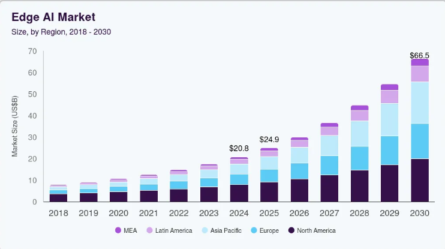
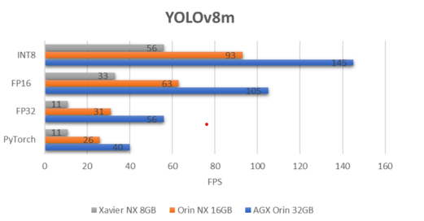
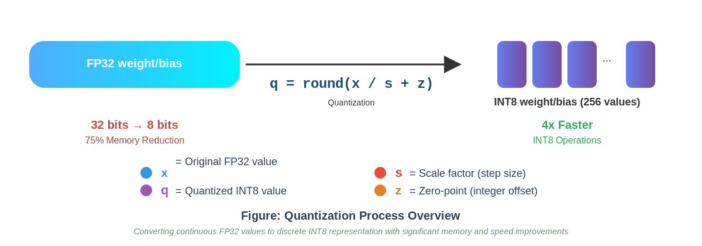
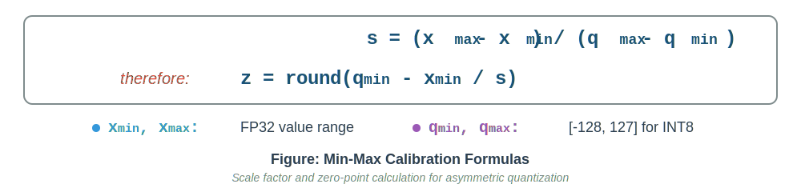
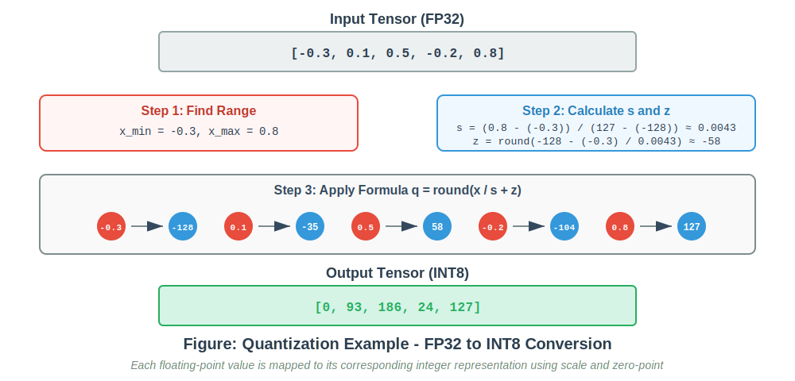
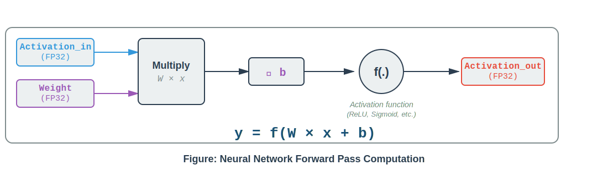
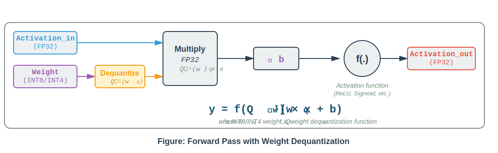
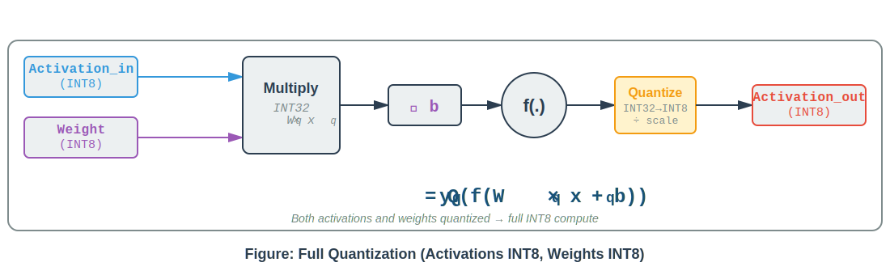

# Quantization - A Solution for Real-Time Inference

## 1. Introduction

In recent years, artificial intelligence has advanced rapidly, transforming industries and daily life. This advancement has driven demand for increasingly larger and more accurate models to support complex applications.  
However, many breakthroughs in AI occur in research labs with abundant computing resources, while real-world applications must run on devices with strict limitations. For example, a computer vision model that performs well on a high-end GPU server might be unusable on a factory robot, an autonomous vehicle, or a mobile device due to tight memory, power, and speed constraints. These limitations become even more critical when applications require real-time inference with millisecond response times.

This fundamental mismatch between research capabilities and deployment realities is not merely a technical challenge—it represents a significant economic opportunity. The rapidly expanding AI application market has driven remarkable growth in the AI inference market. According to Grand View Research's AI Inference Market report, the global AI inference market size was estimated at USD 97.24 billion in 2024 and is projected to reach USD 253.75 billion by 2030, growing at a CAGR of 17.5% from 2025 to 2030.

  

<em>Global AI Inference Market Size (Grand View Research, 2024)</em>

Particularly significant is the global Edge AI Market, which was valued at USD 20.78 billion in 2024 and is expected to grow to USD 66.47 billion by 2030, with a CAGR of 21.7% from 2025 to 2030.

  

<em>Global Edge AI Market Size (Grand View Research, 2024)</em>

These substantial market valuations reflect the pressing need for optimization across multiple dimensions: reducing inference costs, minimizing latency, lowering power consumption, and decreasing environmental impact such as carbon emissions. Whether viewed from a technical or economic perspective, cost optimization in AI is no longer optional but a necessity.  
To address these demanding requirements for both high performance and efficiency, several optimization techniques have been developed. Common approaches include model pruning, knowledge distillation, quantization, and others. Among them, quantization has emerged as one of the most widely adopted solutions. It is particularly important in robotics, embedded systems, and edge computing, where efficiency is paramount.

The widespread adoption of quantization is further supported by the AI ecosystem. Major hardware manufacturers such as NVIDIA, Qualcomm, Intel, and Google have integrated native support for quantization into their processors and accelerators, helping deliver faster inference and improved efficiency. At the same time, popular frameworks like PyTorch and TensorFlow provide built-in tools for quantization, making it easier for developers to apply these techniques in practice. This growing ecosystem ensures that quantization is not just a research idea but a practical solution that continues to shape real-world AI deployment.

A concrete example illustrates this benefit. Deploying YOLOv8m on an NVIDIA Jetson AGX Orin and converting the model from FP32 to INT8 with TensorRT reduces latency by 2–3× and memory usage by about 4×. In practice, this results in a performance gain from 11 FPS (FP32, PyTorch) to 56 FPS (INT8, TensorRT) on Xavier NX 8G, while maintaining comparable accuracy. Such improvements enable AI applications to achieve real-time performance on embedded platforms.

  

<em>Benchmarking YOLOv8n on NVIDIA Jetson AGX Orin</em>

Quantization has evolved from a theoretical optimization technique into a foundational enabler of real-world AI—bridging the gap between research innovation and practical deployment.

## 2. Quantization – From Digital Fundamentals to AI Optimization

Quantization is by no means a new concept. Long before its rise in AI optimization, it was already a fundamental principle of electronics and computing.  
At its core, quantization reflects a simple reality: computers cannot represent every real number with perfect precision. Many rational numbers (like 1/3) and all irrational numbers (like π or √2) must be approximated when stored in digital form, since machines can only map values into a finite number of discrete states defined by the available bits. This unavoidable limitation lies at the heart of all digital systems—from audio and image compression to data transmission, computer architecture, and now, AI.

In modern AI, most models are trained and deployed using 32-bit floating-point precision (FP32). FP32 provides a wide dynamic range and high accuracy, but it comes with significant costs: each value requires 4 bytes of storage, and FP32 operations are computationally expensive. By contrast, lower-precision arithmetic, such as 8-bit integers (INT8), requires fewer bits for storage and fewer instruction cycles for operations. This directly translates into a smaller memory footprint, lower power consumption, and faster inference speeds—critical advantages for real-time applications.

The trade-off, of course, is precision. Lower bit-widths mean coarser value representations, which can lead to information loss. The central challenge of quantization in AI is therefore not simply about reducing precision, but about minimizing accuracy degradation while maximizing efficiency. This balancing act is precisely why quantization has become both a practical optimization technique and a widely adopted approach across modern AI systems.

## 3. Mathematical Foundation

Having established quantization's broad significance across digital systems, this section examines the mathematical principles that govern this process in AI applications. While the concept itself is universal, the specific implementation for neural networks requires careful consideration of how floating-point values are mapped to discrete integers while preserving the model's predictive capabilities.

The mathematical foundation of quantization rests on a deceptively simple premise: any continuous range of values can be systematically mapped to a finite set of discrete representations through two key parameters—scale and zero-point. These parameters act as the bridge between the high-precision world of floating-point arithmetic and the efficiency-optimized realm of integer operations.

  

**Determining Scale and Zero-Point:**  

A critical question arises: how are the optimal values for `s` (scale) and `z` (zero-point) computed? The most straightforward approach uses the min-max method, which maps the minimum and maximum values of the floating-point range directly to the quantized range:

  

However, this simple solution is not always optimal. The choice of scale and zero-point profoundly impacts quantization quality—poor parameter selection can lead to significant accuracy degradation, while well-calibrated parameters preserve model performance even at lower precision. In practice, finding the right balance between range coverage and precision allocation requires understanding the actual distribution of values in the network, not just their extremes. Various advanced calibration techniques exist to address these challenges, as detailed in Part 2: [Calibration Techniques](../part2/calibration_techniques.MD).

**A Concrete Example:**

To illustrate how quantization works in practice, consider a simple tensor containing five floating-point values. The following figure demonstrates the complete quantization process, from finding the value range to computing scale and zero-point parameters, and finally applying the quantization formula to each element.

  

## 4. Quantization Strategies: From Theory to Practice

With the mathematical foundation established, the next step is to examine how quantization is applied in real neural networks. At the heart of nearly every AI model lies a deceptively simple operation: the linear transformation **y = Wx + b**, where weights (W) are multiplied by inputs (x) and added to a bias term (b). This operation—repeated millions of times across layers—is the backbone of modern deep learning, from convolutional networks recognizing faces to transformers generating text. It is also where quantization delivers its most significant impact.

The standard approach trains and runs models entirely in 32-bit floating-point precision (FP32), offering high accuracy but at considerable computational and memory cost. The following diagram illustrates this baseline:

  

While FP32 remains the gold standard for training, inference often does not require such high precision. This observation has led to the development of various quantization strategies, each making different trade-offs between memory, speed, and accuracy. The two most widely adopted approaches in production systems today are weight-only quantization and full quantization.

**Weight-only Quantization** emerged as a practical solution to a pressing problem: how to deploy increasingly large models within tight memory constraints. Consider modern large language models (LLMs) like Llama or GPT variants, which contain billions of parameters. At FP32 precision, these models demand hundreds of gigabytes of memory—far exceeding what most consumer GPUs or edge devices can provide. Weight-only quantization addresses this by storing weights as 8-bit integers (INT8), reducing memory footprint by 4×, while keeping computations in FP32 to preserve accuracy.

  

The workflow is straightforward: quantized weights are loaded from memory, dequantized back to FP32 on-the-fly, then used in standard FP32 arithmetic. This approach has become ubiquitous in serving large language models. For instance, frameworks like llama.cpp and GGML leverage weight-only quantization to run 7B-parameter models on consumer hardware with 8GB of RAM—a feat impossible with full FP32 storage. By storing weights in INT8 or INT4 format, memory footprint is significantly reduced, enabling deployment on resource-constrained devices.

In production deployments, benchmarks show that serving Llama-3.1-8B with 4-bit weight quantization on an NVIDIA H100 GPU achieves approximately 2× throughput increase using frameworks like vLLM and TensorRT-LLM. By storing weights in compact INT4 format, faster memory-to-compute transfer more than compensates for dequantization overhead when memory bandwidth is the bottleneck. For readers interested in detailed performance comparisons, comprehensive benchmarks are available at [SqueezeBits' analysis](https://blog.squeezebits.com/vllm-vs-tensorrtllm-6-weightonly-quantization-33728).

  

<em>Weight-only quantization (WOQ) throughput comparison on Llama-3.1-8B (Source: SqueezeBits)</em>

The trade-off is minimal: though computation remains in FP32, the reduction in memory bandwidth requirements and storage enables deployment scenarios that would otherwise be infeasible. In practice, studies show that 8-bit weight quantization typically incurs less than 1% accuracy degradation on language tasks, making it an attractive option for memory-constrained applications.

**Full Quantization**, by contrast, pursues maximum efficiency by quantizing both weights and activations to INT8. This unlocks the full potential of modern hardware accelerators, which are specifically designed for fast integer arithmetic. Unlike weight-only quantization, full quantization transforms the entire computational pipeline into INT8 operations—from matrix multiplications to accumulations—resulting in dramatic speedups and power savings.

  

The impact is most visible in computer vision models deployed on edge devices. Take object detection networks like YOLO or MobileNet running on smartphones, drones, or embedded cameras. These applications demand real-time performance under strict power budgets. Full INT8 quantization delivers both: deploying YOLOv8m on an NVIDIA Jetson Xavier NX 8G and converting from FP32 to INT8 with TensorRT achieves a dramatic performance gain from 11 FPS to 56 FPS-a 5× speedup-while reducing memory usage by 4×. This enables real-time object detection at over 50 FPS on embedded hardware, transforming what was previously unusable into production-ready performance. Beyond Jetson, Google's Edge TPU and Qualcomm's Hexagon DSP are purpose-built for INT8 operations, achieving similar throughput gains of 4–8× compared to FP32. The challenge, of course, lies in maintaining accuracy. Quantizing activations—which vary dynamically during inference—requires careful calibration to determine optimal scaling parameters. When done correctly, models like ResNet-50 or EfficientNet can be quantized to INT8 with less than 1% accuracy loss, as demonstrated by extensive benchmarking on ImageNet. This makes full quantization the go-to strategy for production deployments in robotics, autonomous vehicles, and mobile applications where both speed and efficiency are critical.

In summary, the choice between weight-only and full quantization depends on the deployment context. If memory is the primary constraint and the target hardware lacks specialized INT8 support, weight-only quantization offers a low-risk path to reduce model size. If speed and energy efficiency are paramount—especially on edge devices with INT8 accelerators—full quantization delivers unmatched performance. Both strategies share a common goal: making AI inference practical, efficient, and scalable in the real world.
## 5. Production Deployment Considerations

While the benefits of quantization are evident across both theoretical and practical evaluations, real-world deployment introduces a new set of challenges. Translating quantized models from research prototypes to production-grade systems is rarely straightforward—it demands careful balancing between efficiency, accuracy, and maintainability.

The path from theory to production deployment is fraught with practical challenges that can derail even well-planned optimization efforts. Understanding these challenges—and the strategies to overcome them—is essential for successful real-world deployment.
    
**The Accuracy Challenge: Beyond Simple Metrics**

The most immediate concern in quantization is accuracy degradation. While converting from FP32 to INT8 theoretically preserves most information, the reality is more nuanced. Quantization errors accumulate as they propagate through deep networks—what begins as a minor precision loss in early layers can compound into significant degradation by the final output. This effect becomes particularly pronounced in models with many layers or complex skip connections, where multiple quantized paths converge.

Not all layers tolerate quantization equally. The first and last layers of a network often prove especially sensitive: the first layer processes raw input data with potentially wide dynamic ranges, while the final classification or regression layer must preserve fine-grained distinctions between classes or output values. Attention mechanisms in transformer models present another challenge—the softmax operation in attention computation is inherently sensitive to small numerical changes, and quantization can disrupt the delicate balance of attention weights. Similarly, normalization layers like LayerNorm and BatchNorm perform statistical computations that assume high precision, making them difficult to quantize without careful handling.

The standard approach of uniform INT8 quantization across all layers rarely achieves optimal results. Instead, production systems typically employ mixed-precision strategies: keeping sensitive layers in FP16 or even FP32 while quantizing the bulk of the network to INT8. This requires systematic analysis to identify which layers can tolerate aggressive quantization and which demand higher precision—a process that remains more art than science, often requiring extensive experimentation and domain expertise.

**Platform Fragmentation: One Model, Many Targets**

A model successfully quantized for deployment on NVIDIA GPUs using TensorRT may still require significant adaptation for Qualcomm mobile processors running QNN or Intel CPUs optimized through OpenVINO. Each platform implements quantization differently: NVIDIA emphasizes symmetric INT8 quantization on Tensor Cores, Qualcomm’s DSPs favor asymmetric quantization with dedicated neural instructions, and Intel’s VNNI extensions introduce yet another optimization pathway. The quantization format that maximizes performance on one platform may not even be compatible with another.

This fragmentation extends beyond hardware to frameworks and toolchains. Converting a PyTorch model to TensorRT requires different steps than exporting to TensorFlow Lite, and each framework imposes its own constraints on model architecture and operator support. Some operations that work seamlessly in FP32 may lack INT8 implementations on certain platforms, forcing unexpected fallbacks to floating-point computation that negate the benefits of quantization. The result is that teams often must maintain multiple quantization pipelines—one per deployment target—each requiring separate validation and optimization.

**Architectural Constraints and Workarounds**

Certain architectural patterns that pose no problems in FP32 become obstacles in quantized networks. Concatenation operations, common in architectures like ResNet and DenseNet, require careful handling when merging tensors with different quantization scales. Element-wise addition in skip connections must account for potential scale mismatches between the main path and the residual. Dynamic shapes and control flow, increasingly common in modern architectures, challenge static quantization schemes that assume fixed tensor dimensions.

Batch normalization folding—the process of absorbing BatchNorm parameters into preceding convolutional layers—is essential for inference efficiency but introduces subtle numerical issues. The folding process can change the effective dynamic range of activations, potentially invalidating calibration performed before folding. Some implementations fold BatchNorm during quantization-aware training to ensure consistency, while others perform post-training folding and must recalibrate afterward.

**The Deployment Pipeline: From Lab to Production**

Quantizing a model is only the beginning. Production deployment requires a robust validation pipeline to ensure the quantized model performs acceptably across the full range of real-world inputs. This means comprehensive testing beyond standard benchmarks: evaluating accuracy on edge cases, measuring latency under various load conditions, and verifying numerical stability with extreme inputs. Teams must establish clear acceptance criteria—often allowing 1-2% accuracy degradation for INT8 quantization—and implement automated gates to prevent deploying models that exceed these thresholds.

Version management becomes more complex with quantized models. Teams must maintain both FP32 baseline models and their quantized variants, tracking which calibration data and methods were used for each version. A/B testing frameworks must support comparing quantized and baseline models in production, monitoring for subtle degradation that may not appear in offline validation. Rollback strategies are essential: if a quantized model exhibits unexpected behavior in production, teams need quick paths to revert to FP32 or redeploy with different quantization parameters.

**The Human Challenge: Skills and Expertise**

Perhaps the most underestimated challenge is organizational. Successful quantization requires expertise spanning multiple domains: deep learning model architectures, numerical optimization, hardware acceleration, and production systems engineering. Few practitioners possess all these skills, yet effective quantization demands their integration. A machine learning engineer may understand model behavior but lack knowledge of hardware-specific quantization formats; a systems engineer may optimize for deployment targets but miss opportunities for architecture-aware quantization strategies.

This skill gap translates directly into time and resource costs. What appears as a straightforward optimization technique—"just quantize to INT8"—often expands into weeks of experimentation, debugging, and iteration. Teams discover that their chosen framework doesn't support a critical operation in INT8, or that their calibration dataset doesn't adequately represent production data, or that their target hardware requires a quantization format incompatible with their training framework. Each discovery triggers additional work, delaying deployment and increasing complexity.

The ecosystem of quantization tools remains fragmented and rapidly evolving. Best practices that work today may be superseded tomorrow by new frameworks, hardware, or techniques. Maintaining expertise across this shifting landscape requires continuous learning and adaptation—a significant investment for teams already stretched by other demands.

These challenges are not insurmountable, but they demand respect and careful planning. Quantization is not a magic optimization that can be applied as an afterthought; it requires integration into the entire model development lifecycle, from initial architecture design through production deployment and monitoring. Teams that succeed treat quantization as a first-class concern, building expertise, tooling, and processes to address its unique challenges. Those that underestimate its complexity often find themselves caught between the promise of efficient inference and the reality of degraded accuracy, platform incompatibilities, and deployment delays.

In essence, quantization's promise extends far beyond numerical compression—it represents a holistic discipline that bridges research innovation and real-world deployment. Teams that master this integration transform quantization from a theoretical optimization into a strategic enabler of scalable, efficient AI systems.

## Reference 
1. https://www.seeedstudio.com/blog/2023/03/30/yolov8-performance-benchmarks-on-nvidia-jetson-devices/  
2. https://www.grandviewresearch.com/industry-analysis/artificial-intelligence-ai-inference-market-report  
3. https://www.grandviewresearch.com/industry-analysis/edge-ai-market-report  

From theory to deployment, the success of quantization depends not only on mathematical formulation but also on how effectively precision loss is managed in practice. Among all the stages in the quantization pipeline, calibration plays a decisive role in determining whether an optimized model maintains its accuracy or collapses under real-world conditions. Though often treated as a minor technical step, calibration directly governs how well quantized representations capture the statistical behavior of activations and weights.
To understand how calibration influences quantization quality and how different techniques balance accuracy with efficiency, continue to [Part 2 – Calibration Techniques: Choosing Optimal Zero Point and Scale](part2\calibration_techniques.MD)